<h2>Motivación:</h2>
Como equipo de back-office, queremos simplificar el proceso de integración de nuevos repositorios. Por esta razón buscamos la manera de automatizar el proceso mediante el uso de <a>Githu Api</a> y entender que permisos y herramientas son necesarios.

### Ticket relacionado <a href="https://itti-digital.atlassian.net/browse/BO-120">BO-120</a>
<h3>Pre requisitos:</h3>

1. generar un grained token <a href="#pat">(ver explicación)</a>. Una vez generado crear un archivo ``.env`` y agregarlo con el nombre ``GITHUB_TOKEN=github_pat_11BMLONUY0goRQtjJXxjfd......elRestoDeTuToken``.

2. El repositorio de origen debe estar configurado como “template” <a href="#repo-temp">(ver explicación)</a>

3. Crear un repo de destino/cliente
- Este debe contener un README.md vacio en la rama  ``main`` (este preoceso se puede mejorar).
- desactivar “branch protection rules enforcement” <a href="#repo-client">(ver explicación)</a>

4. Clonar este repo e instalar los packages necesarios corriendo con ``yarn`` o ``npm``.
En la terminal

``node createRepoPR.js``

<h3 id="pat">Como generar un Grained token?</h3>

- click en to avatar
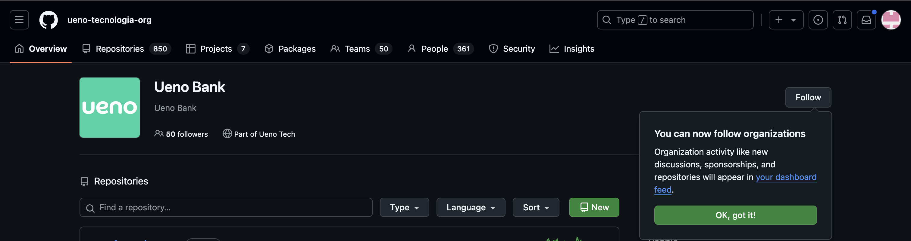

- ir a settings
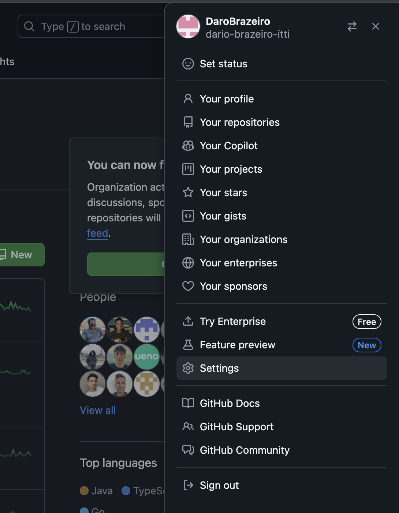

- ir a developper setting s del menu izq (bien a bajo)
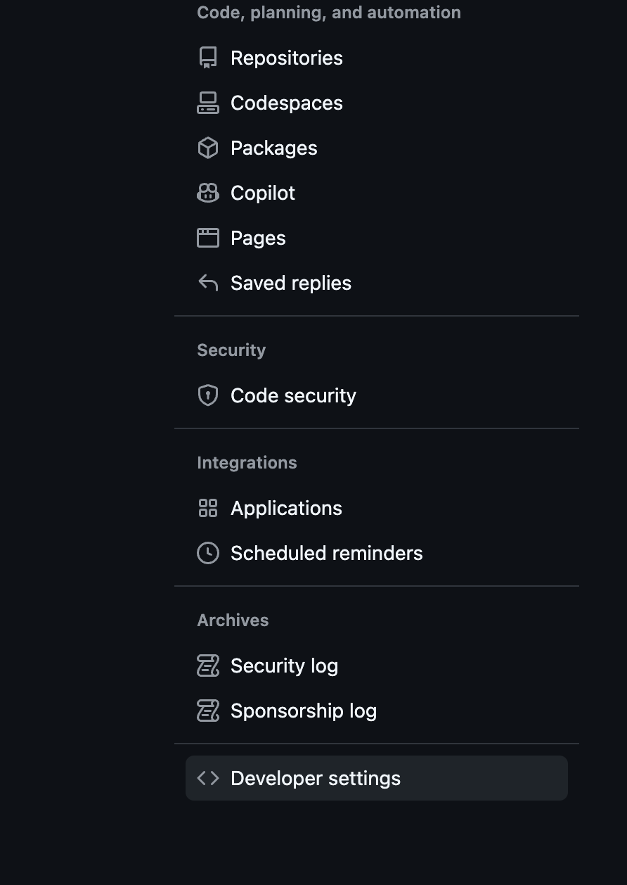

- click en Personal access tokens > Fine-grained tokens > Generate new token.
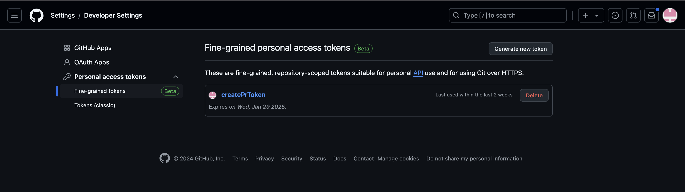

- A demas de elegir el nombre de tu token, es necesario seleccionar All repositories debajo de Repository access 
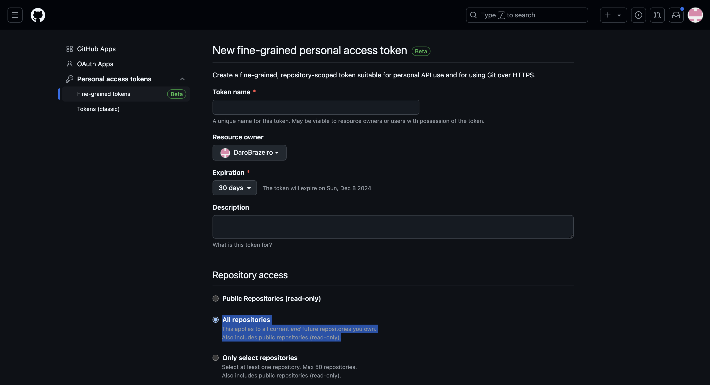

- por ultimo, en la misma pantalla un poco mas abajo, en la seccion de Permissions, seleccionar permisos de read and write para pull requests
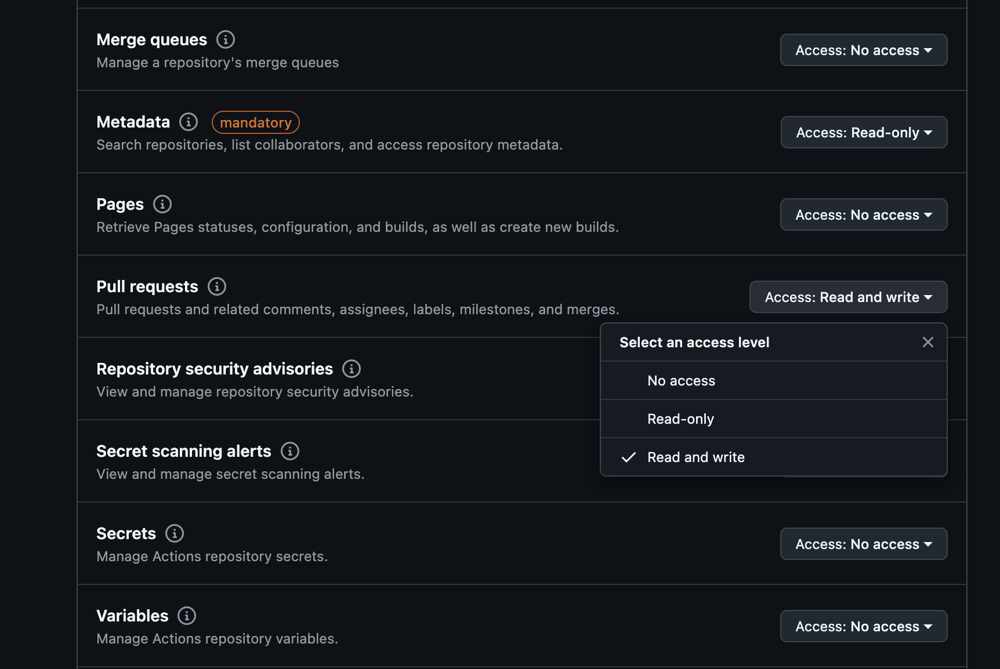

- click en generate token y listo!
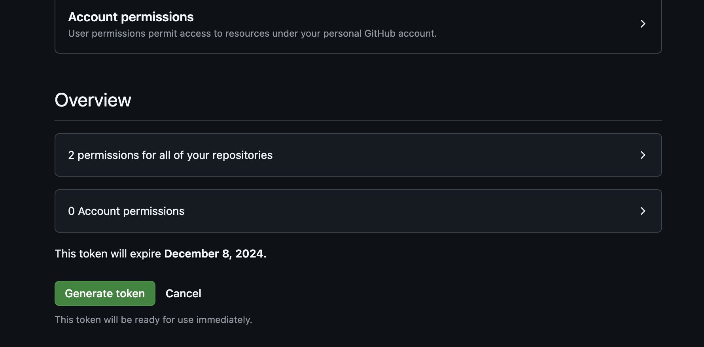

<h3 id="repo-temp">Como configurar el repositorio de origen como template?</h3>

- Dentro del repositorio > Settings y seleccionar Template repository
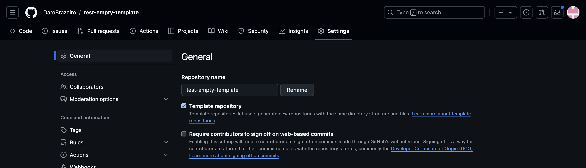

<h3 id="repo-client">desactivar “branch protection rules enforcement”</h3>

- Desde github.com > avatar > repositories y seleccionar el que recien creaste.
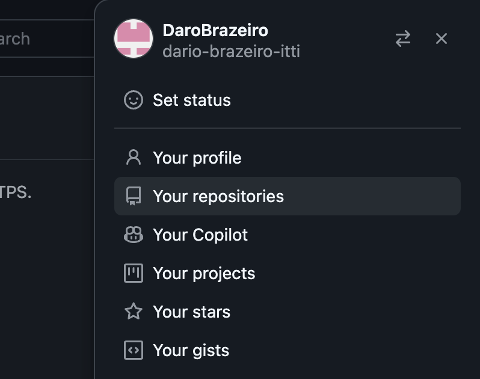
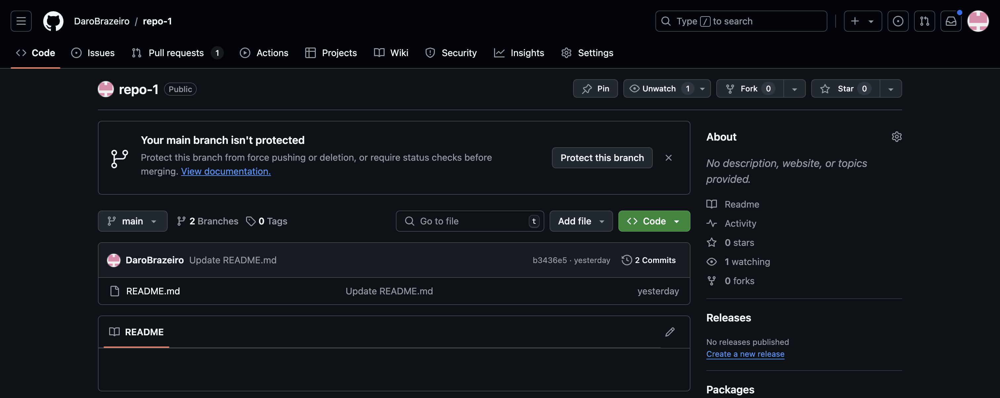
- ir a Settings y al final, debajo de ``Danger Zone`` desactivar ``Disable branch protection rules`` y confirmar.
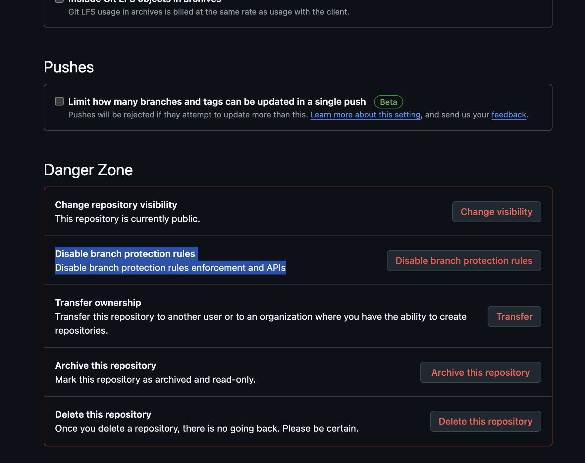
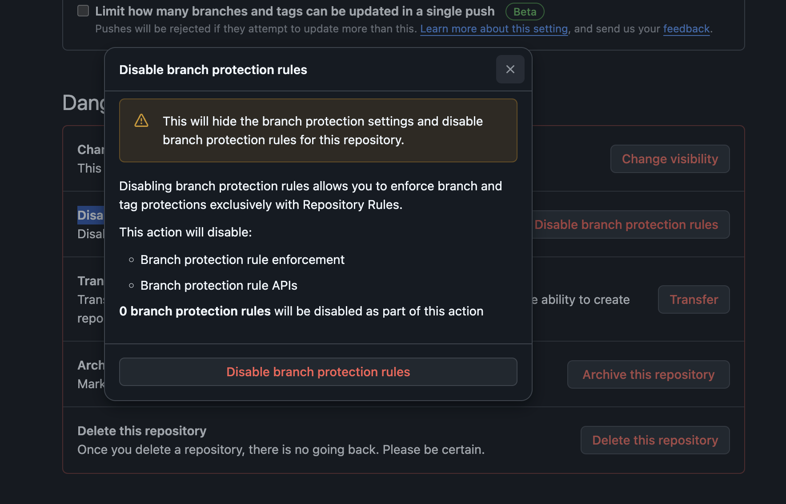